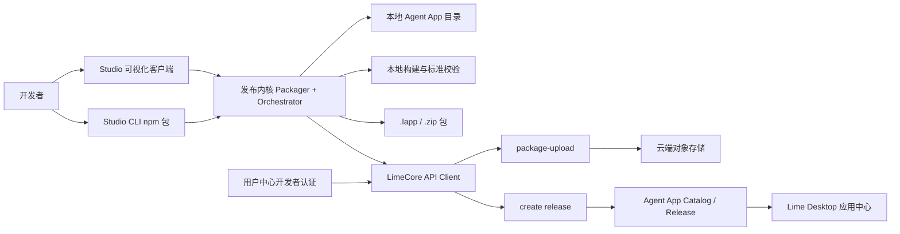
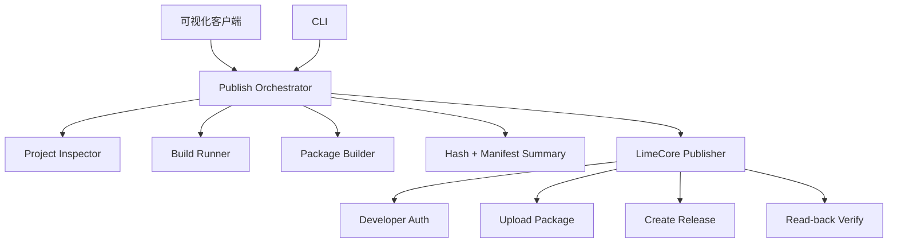
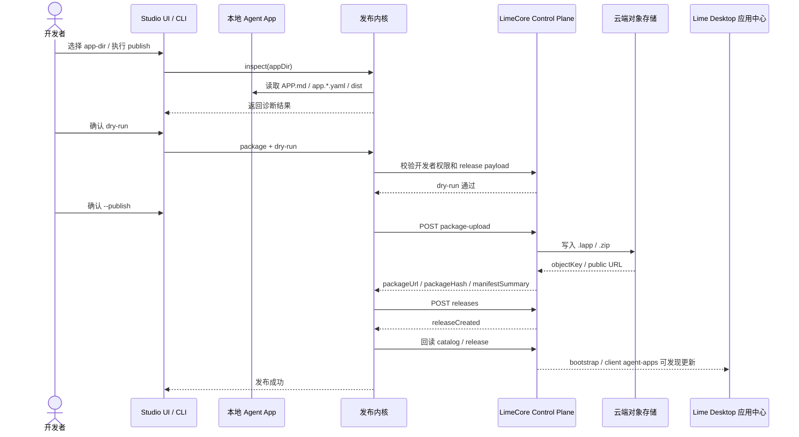
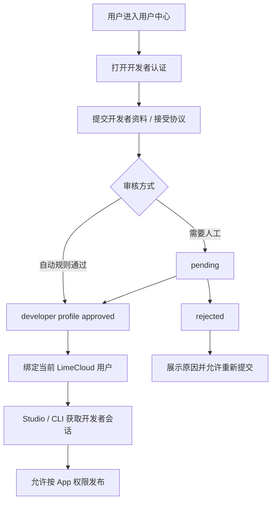
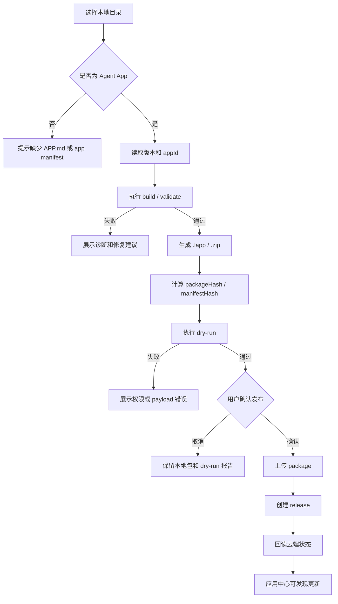
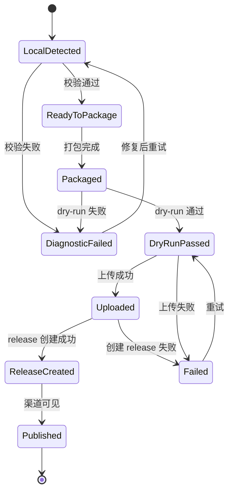

# Lime Agent App Studio v1 PRD

更新时间：2026-05-18

## 一句话目标

Lime Agent App Studio 是面向 Agent App 开发者的发布工作台，提供可视化客户端和 CLI 两种入口，帮助开发者把本地 Agent App 从诊断、构建、打包、上传到云端 Release 的全过程做成可复现、可审计、可回滚的闭环。

## 背景

Lime 已经具备 Agent App 应用中心的基本消费形态：用户可以看到应用来源、状态、本地版本、云端版本和更新入口。但开发者侧仍缺少完整发布工具链：

- 本地 Agent App 的 `dist/`、`vendor/`、`APP.md`、`app.*.yaml`、`locales/`、`skills/` 是否完整，需要人工检查。
- 云端 release 需要可信的 `packageUrl`、`packageHash`、`manifestHash` 和 `manifestSummary`，手动填写容易出错。
- `content-factory-app` 这类真实 App 需要把本地包发布到 LimeCore，再由 Lime Desktop 应用中心发现更新。
- 现有 LimeCore 已有 Agent App catalog、release、package-upload、tenant enablement、audit 等控制面能力，但缺少开发者友好的编排入口。
- 发布动作同时需要人机协作体验和自动化能力：人工发布适合可视化工作台，CI/CD 和脚本化发布需要 CLI。

因此 Studio v1 的重点不是重建云端运行时，而是把现有 Agent App 标准、本地构建校验和 LimeCore 控制面串成一个稳定产品。

## 产品目标

- 提供一条从本地 App 目录到 LimeCore 云端 release 的标准发布路径。
- 支持可视化客户端，让开发者能看到诊断结果、版本差异、包内容、发布风险和发布后状态。
- 支持 CLI，作为可复现发布内核，并发布到 npmjs 供本地终端、CI/CD 和其他工具调用。
- 支持开发者认证与权限校验，确保只有已认证开发者能看到 Studio App，并且只有有权限的开发者可以发布指定 App。
- 支持 App 分类、版本、渠道和可见性管理，为应用中心的筛选、更新和治理提供事实源。
- 复用 LimeCore 现有 `package-upload`、release、catalog、tenant enablement 和 audit，不新增平行发布协议。

## 核心收益

| 对象 | 收益 |
|---|---|
| Agent App 开发者 | 不再手工拼包、复制 URL、计算 hash；可用可视化步骤和 CLI dry-run 规避发布事故。 |
| 平台发布人员 | 发布过程可审计，包元数据、版本、渠道和权限统一进入 LimeCore。 |
| 租户管理员 | 只看到已授权、可安装、可更新的 App，降低错误版本进入企业环境的风险。 |
| Lime 普通用户 | 应用中心中的“可更新”“需要授权”“本地 + 云端”等状态有可信来源。 |
| CI/CD | 通过 npm CLI 复用同一发布内核，实现自动化打包、上传和 release 创建。 |

## 产品形态

Studio v1 分成两个客户端形态，但共享同一个发布内核。

```text
Lime Agent App Studio
  ├─ 可视化客户端：人机协作、诊断、预览、发布确认、审计查看
  └─ CLI：脚本化、CI/CD、可复现 dry-run、npmjs 分发
```

### 可视化客户端

可视化客户端面向日常开发者和平台发布人员，重点是“看得懂、可确认、可追溯”。首版能力：

- 选择本地 Agent App 目录。
- 识别 `appId`、版本、标准版本、入口、能力声明和本地构建状态。
- 展示本地版本、云端最新版本、已安装版本和可更新状态。
- 执行或引导执行 build、validate、readiness 等校验。
- 展示将进入 `.lapp` / `.zip` 的文件清单、大小、hash 和 manifest summary。
- 支持 dry-run，输出将调用的云端 API、release payload 和潜在风险。
- 支持正式发布，完成 package upload 和 release 创建。
- 支持发布后验证，回读云端 catalog / release 状态。
- 展示当前开发者权限、App 归属、发布渠道和审计记录。

### CLI

CLI 是发布内核和自动化入口，必须可脱离可视化客户端运行。CLI 首版发布到 npmjs：

| 项 | 建议 |
|---|---|
| npm package | `@limecloud/agent-app-studio` |
| bin 主命令 | `lime-agent-app-studio` |
| bin 短命令 | `lime-agent-app` |
| 分发渠道 | npmjs public package |
| Node 基线 | Node.js 20+ |
| 默认行为 | `dry-run` 优先，正式写云端必须显式 `--publish` |

CLI 首版命令：

```bash
lime-agent-app-studio auth login
lime-agent-app-studio auth status
lime-agent-app-studio project inspect --app-dir ./content-factory-app
lime-agent-app-studio package --app-dir ./content-factory-app
lime-agent-app-studio publish --app-dir ./content-factory-app --app-id content-factory-app --channel stable --dry-run
lime-agent-app-studio publish --app-dir ./content-factory-app --app-id content-factory-app --channel stable --publish
```

CLI 约束：

- 不内置云端密钥，不写死生产 token。
- 登录态存放在用户级安全存储或系统标准配置目录，不进入项目仓库。
- 所有写云端动作默认输出计划和确认信息；正式发布必须显式传入 `--publish`。
- npm 发布前必须通过 `npm pack --dry-run`、基础命令测试和版本一致性检查。
- CI/CD 使用 token 时必须通过环境变量或平台 secret 注入，不写入配置文件。

## 目标用户与角色

| 角色 | 说明 | 关键动作 |
|---|---|---|
| 个人开发者 | 为自己或小团队开发 Agent App | 本地诊断、打包、发布 draft / beta。 |
| 团队开发者 | 在组织内协作维护 App | 共享 App 权限、提交 release、查看审计。 |
| App Owner | 对某个 App 有最高开发者权限 | 授权维护者、发布 stable、撤销版本。 |
| Maintainer | 维护 App 代码和包 | 执行 build、package、提交 release 候选。 |
| Publisher | 负责发布上线 | 创建 release、切渠道、发布公告。 |
| Viewer | 只读查看发布状态 | 查看版本、校验结果和审计。 |
| 平台管理员 | LimeCore 平台运营 | 管理官方 App、审核开发者、处理违规包。 |
| 租户管理员 | 企业或代理侧管理员 | 启用 App、绑定版本、配置注册码和可见范围。 |
| 普通 Lime 用户 | 使用应用中心安装 / 打开 App | 消费已发布和已授权的 App。 |

## 用户故事

- 作为个人开发者，我希望在 Studio 中选择本地 App 目录后自动看到缺失文件和校验结果，避免发布一个不完整包。
- 作为团队开发者，我希望用 CLI 在 CI 里执行 dry-run，提前发现版本、manifest、dist、hash 或权限问题。
- 作为 App Owner，我希望只有被授权的人可以发布我的 App，所有发布动作都进入审计记录。
- 作为 Publisher，我希望在发布前看到本地版本和云端版本差异，并确认要发布到 draft、beta 还是 stable。
- 作为平台管理员，我希望所有上传包都经过静态校验、hash 计算和敏感字段过滤，避免不可信 release 进入应用中心。
- 作为租户管理员，我希望企业定制 App 可以通过注册码激活，未激活前客户端不能拿到 package URL。
- 作为普通用户，我希望应用中心显示的“可更新”状态准确，不会下载到错误版本。

## 用户用例

### 用例 1：首次发布本地 Agent App

1. 开发者在用户中心完成开发者认证。
2. 开发者打开 Studio 可视化客户端并登录 LimeCloud。
3. 选择本地 App 目录。
4. Studio 识别 `APP.md`、`app.capabilities.yaml`、`dist/` 和版本号。
5. Studio 执行构建与校验。
6. Studio 生成 `.lapp` 包并展示包预览。
7. 开发者选择 `draft` 渠道并执行 dry-run。
8. dry-run 通过后，开发者点击发布。
9. Studio 上传 package 并创建 release。
10. Studio 回读云端 release，显示发布成功。

### 用例 2：CI/CD 自动发布 beta

1. CI 安装 npm CLI：`npm install -g @limecloud/agent-app-studio`。
2. CI 使用 secret 注入 LimeCloud 发布 token。
3. CI 执行 `lime-agent-app publish --app-dir . --channel beta --dry-run`。
4. dry-run 通过后，受保护分支执行 `--publish`。
5. LimeCore 写入 release 和 audit。
6. 应用中心 beta 通道用户可看到更新。

### 用例 3：企业定制 App 发布后授权

1. 开发者发布企业定制 App release。
2. 平台或代理后台为租户启用该 App。
3. 租户管理员设置或轮换注册码。
4. Lime 客户端应用中心显示“需要激活”。
5. 用户输入注册码后，客户端获得 package metadata 并安装。

### 用例 4：发布失败排查

1. Studio 显示 package upload 失败。
2. 开发者查看错误分类：认证失败、权限不足、包超限、manifest 不匹配、存储未配置、网络失败。
3. Studio 展示可复制的 CLI 复现命令。
4. 开发者修复后重新执行 dry-run。

## 信息架构

```text
Lime Agent App Studio
  首页 / 项目列表
    ├─ 最近项目
    ├─ 本地目录导入
    └─ 云端 App 列表
  项目工作台
    ├─ 概览：本地版本、云端版本、权限、风险
    ├─ 诊断：文件、manifest、dist、依赖、标准版本
    ├─ 构建：build、validate、readiness、测试建议
    ├─ 打包：包内容、体积、hash、manifest summary
    ├─ 发布：dry-run、upload、release、渠道、release notes
    ├─ 云端：catalog、releases、tenant enablement、audit
    └─ 设置：登录、开发者认证、默认 API endpoint、npm CLI 指引
```

## App 分类设计

Studio v1 需要同时支持“来源分类”和“领域分类”。来源分类决定治理和权限，领域分类决定应用中心展示和筛选。

### 来源分类

| 分类 | 说明 | 默认权限 |
|---|---|---|
| 官方应用 | Lime 官方维护的 App | 平台管理员和官方 Publisher 发布。 |
| 企业定制应用 | 为特定租户或代理定制 | App Owner / Publisher 发布，租户启用后可见。 |
| 团队私有应用 | 团队内部使用 | 团队成员按角色发布和查看。 |
| 开发调试应用 | 仅用于本地或 beta 测试 | 默认不可进入 stable。 |
| 模板应用 | 可复制、可二次开发 | 可公开展示，但发布实例需绑定 owner。 |

### 领域分类

| 分类 | 示例 |
|---|---|
| 内容生产 | 内容工厂、公众号文章、短视频脚本、营销素材。 |
| 知识管理 | 项目资料、知识库整理、问答助手。 |
| 办公自动化 | 表格处理、文档生成、会议纪要。 |
| 数据分析 | 报表、指标解释、业务复盘。 |
| 开发者工具 | 代码审查、发布工具、接口调试。 |
| 行业应用 | 教育、法务、医疗、金融、跨境电商等垂直场景。 |

分类规则：

- 每个 App 必须有一个来源分类。
- 每个 App 可以有多个领域分类。
- 开发调试应用默认只允许 draft / beta，不允许直接 stable。
- 企业定制应用默认需要 tenant enablement 和 registration code。
- 官方应用需要平台管理员或官方 Publisher 权限。

## 开发者认证与权限

Studio v1 依赖 LimeCloud 用户中心提供开发者认证。认证通过后，当前用户获得 developer profile，并可在 Studio 和 CLI 中使用。

### 开发者认证状态

| 状态 | 说明 | Studio 行为 |
|---|---|---|
| `not_requested` | 未申请 | 应用中心不可见 Studio App；只能在用户中心查看认证入口、公开文档和 CLI 指引。 |
| `pending` | 已提交申请 | 应用中心不可见 Studio App；可查看申请进度，不可上传和创建 release。 |
| `approved` | 已认证 | 应用中心可见 Studio App；可按权限管理 App 和 release。 |
| `suspended` | 暂停 | 应用中心隐藏或禁用 Studio App；禁止上传、发布和授权变更。 |
| `rejected` | 审核拒绝 | 应用中心不可见 Studio App；展示拒绝原因和重新申请入口。 |

### App 权限角色

| 角色 | 权限 |
|---|---|
| Owner | 管理 App 信息、成员、发布 stable、撤销 release、转移归属。 |
| Maintainer | 本地诊断、打包、上传候选包、创建 draft / beta release。 |
| Publisher | 创建 release、切换渠道、发布 stable、填写 release notes。 |
| Viewer | 查看 App、release、diagnostics 和 audit。 |

Studio App 可见性规则：

- Lime Desktop 应用中心只向 `approved` 开发者展示 Lime Agent App Studio。
- `not_requested`、`pending`、`rejected` 用户不能在应用中心看到、安装或打开 Studio App。
- `suspended` 用户应隐藏 Studio App，或展示禁用态并阻止所有写云端动作。
- 用户中心的“开发者认证”入口始终可见，负责承接未认证用户的开通路径。
- CLI 可以通过 npmjs 公开安装，但 `auth status` 和所有写云端命令必须以服务端开发者认证状态为准。

发布动作必须同时满足：

- 当前用户已完成开发者认证。
- 当前用户拥有目标 App 的有效角色。
- 目标 App 来源分类允许当前渠道。
- 目标租户或组织范围允许该 release 可见。
- 云端 API 返回的权限快照与本地展示一致。

## 发布工作流

```text
选择目录
  -> 本地识别
  -> 构建校验
  -> 打包预览
  -> dry-run
  -> 上传 package
  -> 创建 release
  -> 回读云端状态
  -> 应用中心发现更新
```

发布状态：

| 状态 | 说明 |
|---|---|
| `local_detected` | 已识别本地 Agent App。 |
| `diagnostic_failed` | 本地诊断失败，不能发布。 |
| `ready_to_package` | 构建和校验通过，可打包。 |
| `packaged` | 已生成 `.lapp` / `.zip` 和 hash。 |
| `dry_run_passed` | 云端权限、payload、版本检查通过。 |
| `uploaded` | package 已上传并生成 URL / hash。 |
| `release_created` | release metadata 已写入 LimeCore。 |
| `published` | 目标渠道可见。 |
| `failed` | 发布失败，可重试或回滚。 |

## 系统架构图



## CLI 与可视化共享内核图



## 发布时序图



## 开发者认证流程图



## 发布流程图



## 发布状态机



## 云端接口依赖

Studio v1 不发明平行协议，优先复用 LimeCore 已有 Agent App 控制面：

- `GET /api/v1/platform/agent-apps`
- `POST /api/v1/public/tenants/:tenantId/client/developer/agent-apps/:appId/package-upload`
- `POST /api/v1/public/tenants/:tenantId/client/developer/agent-apps/:appId/releases`
- `POST /api/v1/platform/agent-apps/:appId/package-upload`（平台后台保留）
- `POST /api/v1/platform/agent-apps/:appId/releases`（平台后台保留）
- `GET /api/v1/platform/agent-apps/:appId/releases`
- `GET /api/v1/public/tenants/:tenantId/client/agent-apps`
- `POST /api/v1/public/tenants/:tenantId/client/agent-apps/:appId/registration`

Studio 需要的新增云端能力优先收敛到开发者认证、权限查询、开发者上传 / release 代理入口和 audit 查询，不新增 Agent App 执行面。

## 安全与风控

- 上传包只做静态检查，不运行包内代码。
- `manifestSummary` 禁止包含 api key、token、secret、credential、客户内容和私有知识全文。
- 正式发布必须记录操作者、App、版本、渠道、包 hash、manifest hash、时间和来源客户端。
- 企业定制 App 未激活注册码前，客户端不得获得 package URL / hash。
- CLI token 不得写入项目目录或 Git 仓库。
- 失败日志不得输出云端密钥、注册码明文或用户隐私内容。

## 非目标

- 不在 Studio v1 中实现 Agent App 运行时、Worker 执行或 Host Bridge。
- 不在 LimeCore 中执行 Agent App 包内 UI、脚本、worker 或 agent runtime。
- 不覆盖 Service Skill、专家、站点适配器等非 Agent App 资源发布。
- 不在首版实现复杂审核市场、收费结算、插件分成或公开市场排名。
- 不要求普通 Lime 用户理解 package、hash、release 或 manifest。

## 验收标准

- Studio PRD 清楚定义可视化客户端和 CLI 两种产品形态。
- CLI npmjs 发布策略清楚，包括包名、bin 名、Node 基线、dry-run 和 publish 行为。
- 发布链路能从本地 App 目录闭环到 LimeCore release，并回读云端状态。
- 开发者认证和 App 权限是发布前置条件。
- App 分类同时覆盖来源治理和应用中心筛选。
- 文档明确复用 LimeCore 现有控制面，不新增云端 Agent Runtime。

## v1 默认假设

- Studio v1 只写 Agent App 发布工具链，不做 App 内业务开发 IDE。
- 可视化客户端和 CLI 共享发布内核；可视化层不得复制一套独立发布逻辑。
- CLI 必须发布到 npmjs，便于开发者本地安装和 CI/CD 使用。
- 首版开发者认证可以从“申请 + 审核 + developer profile”开始，细节可后续落到用户中心实现文档。
- `content-factory-app` 是首个端到端验证对象。
